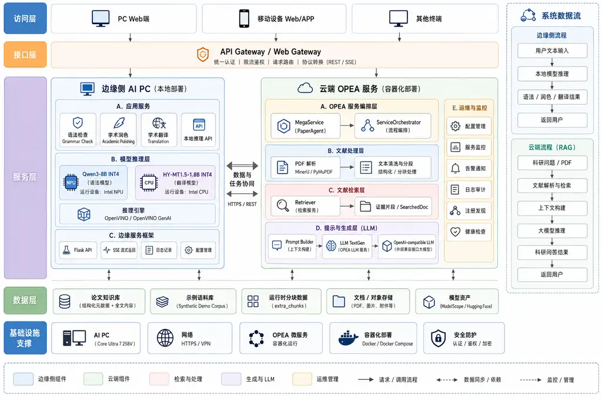

# PaperAgent - AI for Good OPEA Competition Edition

PaperAgent is an **OPEA-based cloud-edge academic intelligence agent**. It combines privacy-sensitive local OpenVINO inference on an AI PC with an OPEA MicroService/MegaService pipeline for literature retrieval and grounded academic question answering.

This repository is the public competition edition. Credentials, real research corpora, private development data, internal network configuration, machine-specific backups, runtime uploads, logs, caches, and model weights are intentionally excluded.



## Why PaperAgent

Academic AI workflows have conflicting requirements. Drafts, unpublished text, and sensitive material benefit from local processing, while literature retrieval and knowledge orchestration benefit from modular cloud services. PaperAgent separates these workloads instead of forcing every task into a single cloud-only or local-only runtime.

The project is designed for researchers, universities, R&D teams, and enterprise knowledge workers that need:

- local grammar checking and academic polishing;
- local multilingual academic translation;
- literature retrieval and grounded question answering;
- modular OPEA service orchestration;
- reproducible open-source deployment without publishing private datasets or credentials.

## AI for Good / Enterprise Value

PaperAgent lowers the privacy and infrastructure barriers of AI-assisted academic work. Sensitive writing tasks remain on the user's AI PC, while OPEA provides a modular cloud-native path for retrieval and grounded generation. This design supports organizations that need both practical GenAI capability and clearer control over where data is processed.

## Key Features

- **Real local model inference** - Qwen3-8B INT4 OpenVINO runs on Intel NPU for grammar checking and academic polishing.
- **Dedicated local translation model** - HY-MT1.5-1.8B is prepared as OpenVINO INT4 and runs on CPU.
- **OPEA enterprise RAG** - Retriever MicroService + Prompt MicroService + official OPEA LLM TextGen + ServiceOrchestrator/MegaService.
- **ModelScope-first deployment** - required models are downloaded automatically from ModelScope by default, with Hugging Face retained as a fallback.
- **Privacy-aware cloud-edge placement** - local writing assistance is separated from cloud literature orchestration.
- **Sanitized competition data** - only a small synthetic paper record is committed.
- **Unified application entry** - Vue/Vite, Flask, Gradio, and Nginx provide a complete prototype UI and API path.
- **Automated checks** - deployment verification, OPEA topology validation, CI checks, and tracked-source sensitive-data scanning are included.

## Architecture

PaperAgent separates privacy-sensitive local writing assistance from cloud-side literature retrieval and knowledge orchestration. The edge service runs local OpenVINO models on the AI PC, while the cloud side uses OPEA MicroServices and MegaService orchestration for document processing, retrieval, prompt construction, and grounded generation.

The edge service is intentionally not forced into the OPEA runtime. OPEA is used where modular service composition is most valuable: literature retrieval, prompt construction, LLM integration, and enterprise knowledge orchestration.

## OPEA Component Mapping

| PaperAgent component | Implementation | OPEA role |
| --- | --- | --- |
| Literature retrieval | `CLOUD/opea/retriever_service.py` | `ServiceType.RETRIEVER` MicroService |
| Prompt construction | `CLOUD/opea/prompt_service.py` | `ServiceType.PROMPT_TEMPLATE` MicroService |
| Language generation | `opea/llm-textgen` | official OPEA LLM MicroService |
| Runtime orchestration | `CLOUD/opea/megaservice.py` | `ServiceOrchestrator` + MegaService |
| Application integration | `CLOUD/src`, `EDGE`, Nginx | UI/API integration |

OPEA runtime flow:

```text
paperagent-retriever
        |
        v
paperagent-prompt
        |
        v
opea-service@llm
        |
        v
PaperAgent MegaService
```

The MegaService exposes:

```text
POST http://localhost:7008/v1/paperagent
GET  http://localhost:7008/v1/topology
```

Detailed OPEA implementation notes are available in [`CLOUD/opea/README.md`](CLOUD/opea/README.md).

## One-click Deployment

### Complete competition demo

Target environment:

- Windows 10/11 x64;
- Intel Core Ultra platform with a working Intel NPU driver;
- Docker Desktop with Docker Compose for the OPEA stack;
- internet access during first-time dependency/model preparation;
- sufficient free disk space for model assets, container images, and Python dependencies.

Run from the repository root:

```powershell
.\deploy.bat
```

The deployment entry prepares the real runtime models before the application starts.

### Model preparation

Default source: **ModelScope**.

| Model | Default source | Runtime |
| --- | --- | --- |
| Qwen3-8B INT4 OpenVINO | `OpenVINO/Qwen3-8B-int4-cw-ov` | Intel NPU |
| HY-MT1.5-1.8B | `Tencent-Hunyuan/HY-MT1.5-1.8B` | converted locally to OpenVINO INT4 / CPU |

Model weights are runtime assets and are never committed to Git.

The preparation logic is implemented in:

```text
scripts/download_models.ps1
models/model-manifest.yaml
```

If ModelScope is temporarily unavailable, the script automatically tries the configured Hugging Face fallback.

To force Hugging Face as the primary source:

```powershell
$env:PAPERAGENT_MODEL_SOURCE = "huggingface"
.\deploy.bat
```

Existing valid models are reused automatically.

### Deployment modes

```powershell
# Edge + OPEA cloud
.\deploy.bat

# Edge / AI-PC only
.\deploy.bat -EdgeOnly

# OPEA cloud only
.\deploy.bat -OPEAOnly

# Reuse locally prepared models
.\deploy.bat -SkipModelDownload

# Prepare configuration/dependencies without starting services
.\deploy.bat -SkipStart

# CI/non-interactive mode
.\deploy.bat -NonInteractive
```

## OPEA LLM Configuration

The edge AI models are downloaded automatically. The OPEA LLM TextGen component connects to a user-supplied OpenAI-compatible language-model endpoint so that the cloud layer can be evaluated with the reviewer's or enterprise's preferred serving environment.

Interactive deployment asks for:

1. OpenAI-compatible LLM endpoint;
2. model ID;
3. API key.

For non-interactive deployment:

```powershell
$env:PAPERAGENT_LLM_ENDPOINT = "https://<YOUR_PROVIDER_HOST>"
$env:PAPERAGENT_LLM_MODEL_ID = "<YOUR_MODEL_ID>"
$env:PAPERAGENT_LLM_API_KEY = "<YOUR_API_KEY>"
.\deploy.bat -NonInteractive
```

Optional MinerU PDF parsing:

```powershell
$env:MINERU_API_TOKEN = "<YOUR_MINERU_TOKEN>"
```

Credentials are written only to local git-ignored runtime configuration:

```text
CLOUD/config.yaml
CLOUD/opea/.env
```

## Runtime URLs

| Component | Port / URL |
| --- | --- |
| Unified PaperAgent UI | `http://localhost:5000/` |
| Edge Flask API | `http://localhost:5001/` |
| Vue/Vite frontend | `http://localhost:5173/` |
| Cloud Gradio UI | `http://localhost:7007/` |
| OPEA MegaService | `http://localhost:7008/v1/paperagent` |
| OPEA Retriever | `http://localhost:7011/` |
| OPEA Prompt Builder | `http://localhost:7012/` |
| OPEA LLM TextGen | `http://localhost:9000/` |

## Demo

See the reviewer-oriented guide:

- [Competition Demo Guide](docs/demo-guide.md)

Recommended end-to-end evaluation:

1. deploy PaperAgent with `deploy.bat`;
2. test local grammar checking and academic polishing;
3. test local HY-MT academic translation;
4. run a literature question through the OPEA RAG path;
5. inspect the OPEA topology endpoint;
6. run `verify_new_computer.bat` to verify the deployment.

## Technical Report

- [Technical Report - Markdown](technical-report.md)
- `technical-report.pdf` - two-page competition report

## Competition Data Policy

Only a small sanitized demonstration record is included:

```text
CLOUD/chunks/lunwen/demo_paper.jsonl
```

The original development corpus is not part of this release. Runtime documents are stored only in ignored directories. See:

- [DATA_POLICY.md](DATA_POLICY.md)
- [SECURITY.md](SECURITY.md)

## Repository Layout

```text
CLOUD/
├─ src/                         Gradio UI, PDF workflow, compatibility path
├─ chunks/lunwen/               sanitized synthetic demonstration record
└─ opea/
   ├─ retriever_service.py      OPEA RETRIEVER MicroService
   ├─ prompt_service.py         OPEA PROMPT_TEMPLATE MicroService
   ├─ megaservice.py            OPEA ServiceOrchestrator / MegaService
   ├─ docker-compose.yml        OPEA runtime topology
   └─ .env.example              provider-neutral environment template

EDGE/                           OpenVINO edge service and Vue frontend
models/                         model manifest only; runtime weights ignored
nginx/                          reverse-proxy template
scripts/
├─ deploy.ps1                   main environment/application deployment
├─ deploy_opea.ps1              OPEA deployment and smoke test
├─ download_models.ps1          ModelScope-first model preparation
└─ scan_sensitive.ps1           tracked-source security scan

docs/
├─ demo-guide.md
└─ architecture-overview.webp   competition architecture diagram

LICENSE                         Apache License 2.0
technical-report.md             competition technical report source
technical-report.pdf            two-page competition technical report
deploy.bat                      one-click competition deployment entry
verify_new_computer.bat         integrated verification
```

## Security Check Before Submission

```powershell
powershell -ExecutionPolicy Bypass -File .\scripts\scan_sensitive.ps1 -TrackedSourceOnly
```

The public competition repository must not contain API keys, MinerU tokens, private `.env` files, model weights, real paper corpora, runtime uploads, internal addresses, tunnel configuration, or machine-specific backups.

## License

PaperAgent source code is licensed under the **Apache License 2.0**. See [LICENSE](LICENSE).

Third-party frameworks and model assets remain subject to their respective upstream licenses. Model weights are not redistributed by this repository; they are downloaded from their distribution sources during deployment.
